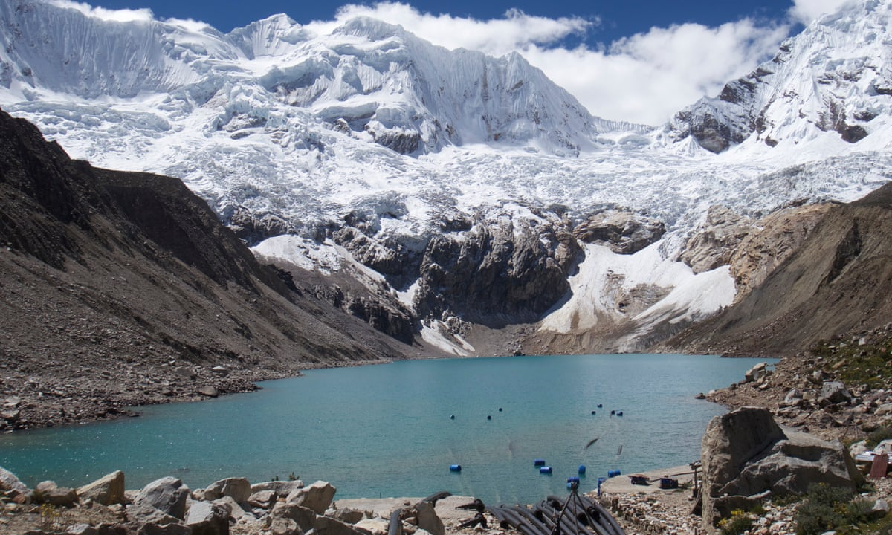

# Glacial Lake Depth Classification

## TABLEAU DASHBOARD: [Tableau Public Workbook](https://public.tableau.com/views/LAGOS-NEACaseStudywithTableauVisualizations/Dashboard3?:language=en-US&publish=yes&:display_count=n&:origin=viz_share_link)

## About 
Lake is any large body of slowly moving or standing water that occupies an inland basin of appreciable size. Glacial lake are formed at relatively higher altitudes when glacier melts down and gets trapped in between boundaries created by dirst, rock and debris called **moraines**. Glacial lake is a topic of extensive research and significance as bursting of these lakes causes floods in the downplain causing havoc. Lakes containing large volumes of water are more susceptible to outburst phenomenon and hence classifying these lakes into **shallow** and **deeper** ones can be used as early warnining.

  

## Methodology
A Machine learning based classifier has been used for classifying the lake depths. Following parameters have been considered:

* **Landsat 8 Bands**
  * Visible Bands (Red, Green & Blue)
  * Infrared Bands (NIR & SWIR)
  * Thermal Bands
* **Lake Area**
* **Lake Elevation**

### *Dataset* 
The glacial lake inventory is very scarce especially the availability of in-situ depth measurements. In our study, we extracted the Bathymetry dataset of the Cordillera Blanca, Peru which is publicly availble and can be accessed from [here](https://onlinelibrary.wiley.com/doi/abs/10.1002/esp.4826). This dataset contains information(coordinates, region, area, elevation, maximum depth, etc.) about 121 glacial lakes in the region. 

The Glacial dataset is not sufficient to train a good ML model. So a different approach has been adopted in the study. The optical characteristics of water bodies as seen from the satellite can be assumed to be same whether it is a glacial or any other lake. So our ML model is trained on LAGOS-NE dataset.

### *Training Dataset*
The physical characteristics of the lake (Area, Maximum depth, and elevation) is extracted from the LAGOS-NE dataset which can be accessed from CRAN [LAGOSNE](https://cran.r-project.org/web/packages/LAGOSNE/index.html) package. LAGOS-NE contains data for 51 101 lakes and reservoirs larger than 4 ha in 17 lake-rich US states. Out of all the lakes, lakes with available maximum depth were extracted and merged with elevation and lake area data using R. Other features like centroid coordinates (latitude and longitude) were also taken for further use. The lakedepth(maxdepth), latitude(nhd_lat) and longitude is stored in **lakes_limno** table in the database whereas other features can be found in the **locus** table. Each lake is assigned with a specific id called lagoslakeid and has been kept unchanged throughout this analysis for any referencing in future. 

### *Data Preprocessing*

The extracted data from LAGOS-NE have been further merged with LANDSAT band values. For this purpose **Google Earth Engine** is used to extract the desired values for given coordinates(latitude, longitude) and time duration which is kept from (April 2013 - April 2014). For the given duration, multiple band values are availble so median of all the values is taken into consideration. After retrieving the LANDSAT bands, the training data consisting of LANDSAT bands, lake elevation and lake area, is scaled.

For y labels(supervised learning) the maximum depth is categorized into two classes: 0: 0-15m & 1: >15m. 

### *Feature Selection*
LANDSAT8 have have 3 visible bands, 3 infrared bands(NIR, SWIR1, SWIR2), and 2 thermal bands. It is important to select only relevant features which are highly uncorrelated among themselves. Hence for this study, 1 visible band(B2), 1 NIR band(B5), 1 SWIR band(B6), 1 thermal band(B10) are selected. These 4 bands along with lake elevation and lake area are considered for training the model.

### *Training*
The training dataset is splitted into training and validation dataset in the 80-20 ratio. **Light Gradient Boosting Model** is trained on the training dataset, which is an ensemble model based on decision trees. The validation dataset is used to tune following hyperparameters of the model.
* max_depth = 5
* num_iterations = 100
* num_leaves = 8
* learning_rate = 0.01
* regularization terms
  * reg_alpha = 2.5
  * reg_lambda = 2.5

### *Result and Discussion*

* Training Accuracy = **84.4%**
* Test Accuracy = **81.3%**

The model is performing well considering the amount of data it is trained upon which reflects a strong potential of estimating the depths of lakes from satellite data alone. However, for testing the model on the glacier lake data collected in the begining, the model must be fine-tuned with glacier lake dataset because although they all are water bodies but the parameters taken into consideration like elevation, thermal bands, etc vary greatly from lakes in plain region to glacier lakes. 

## Libraries Used
* [Numpy](https://numpy.org/)
* [Pandas](https://pandas.pydata.org/)
* [Matplotlib](https://matplotlib.org/)
* [Seaborn](https://seaborn.pydata.org/)
* [sklearn](https://scikit-learn.org/)
* [lightgbm](https://lightgbm.readthedocs.io/en/latest/pythonapi/lightgbm.LGBMClassifier.html)
* [geextract](https://pypi.org/project/geextract/)

