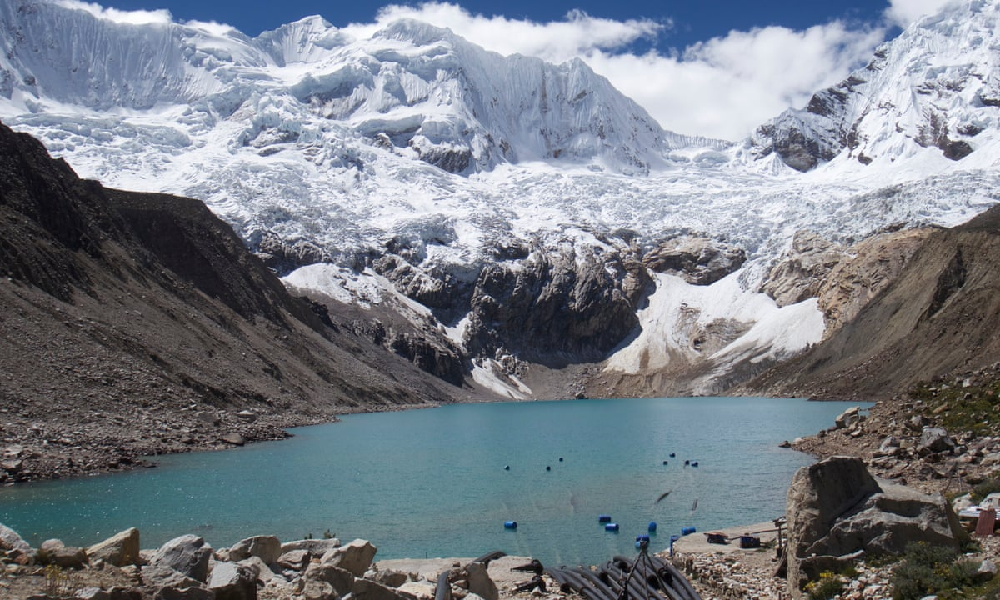

# Glacial Lake Depth Classification

## About 
Lake is any large body of slowly moving or standing water that occupies an inland basin of appreciable size. Glacial lake are formed at relatively higher altitudes when glacier melts down and gets trapped in between boundaries created by dirst, rock and debris called **moraines**. Glacial lake is a topic of extensive research and significance as bursting of these lakes causes floods in the downplain causing havoc. Lakes containing large volumes of water are more susceptible to outburst phenomenon and hence classifying these lakes into **shallow** and **deeper** ones can be used as early warnining.

## Methodology
A Machine learning based classifier has been used for classifying the lake depths. Following parameters have been considered:
* Landsat 8 Bands
  * Visible Bands (Red, Green & Blue)
  * Infrared Bands (NIR & SWIR)
  * Thermal Bands
* Lake Area
* Lake Elevation

**Light Gradient Boosting Model** is used for the purpose which is an ensemble model based on decision trees. Following hyperparameters are tuned in order to achieve best results:
* max_depth = 5
* num_iterations = 100
* num_leaves = 8
* learning_rate = 0.1
* regularization terms
  * reg_alpha = 2.5
  * reg_lambda = 2.5

## Data Extraction
The physical characteristics of the lake (Area, Maximum depth, and elevation) is extracted from LAGOS-NE dataset which can be accessed from CRAN [LAGOSNE](https://cran.r-project.org/web/packages/LAGOSNE/index.html) package. LAGOS-NE contains data for 51 101 lakes and reservoirs larger than 4 ha in 17 lake-rich US states. Out of all the lakes, lakes with available maximum depth were extracted and merged with elevation and lake area data using R. Other features like centroid coordinates (latitude and longitude) were also taken for further use. The lakedepth(maxdepth), latitude(nhd_lat) and longitude is stored in **lakes_limno** table in the database whereas other features can be found in the **locus** table. Each lake is assigned with a specific id called lagoslakeid and has been kept unchanged throughout this analysis for any referencing in future. 

## Libraries Used
* [Numpy](https://numpy.org/)
* [Pandas](https://pandas.pydata.org/)
* [Matplotlib](https://matplotlib.org/)
* [Seaborn](https://seaborn.pydata.org/)
* [sklearn](https://scikit-learn.org/)
* [lightgbm](https://lightgbm.readthedocs.io/en/latest/pythonapi/lightgbm.LGBMClassifier.html)

